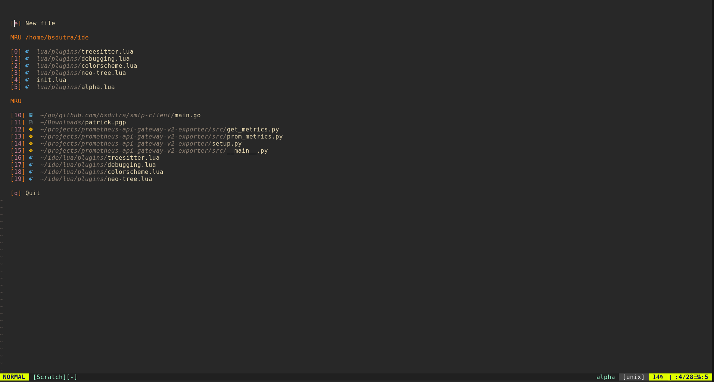
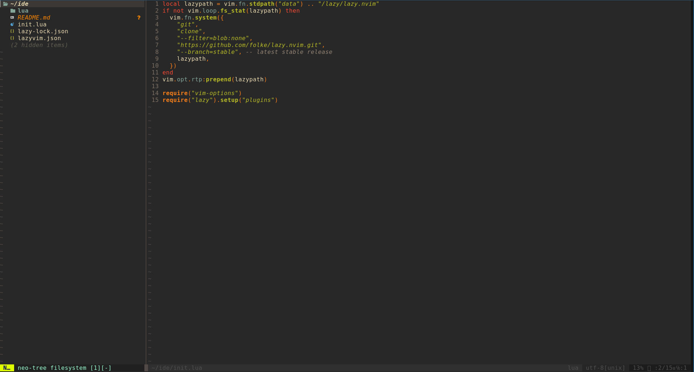

<p align="center">
  <h3 align="center">Neovim setup</h3>
  <p align="center">
    <a href="https://twitter.com/bsdutra_">
      
    </a>
  </p>
</p>

<hr>

## Installation

To install the configuration, clone this repository to `~/.config/nvim`

```sh
git clone https://github.com/bsdutra/nvim-ide ~/.config/nvim
```

### Installing Neovim on ArchLinux

```sh
pacman -S neovim
```

### Installing Neovim on FreeBSD

```sh
pkg install neovim
```

<hr>

## Plugins

* Alpha
* Colorscheme (gruvbox)
* Debbuging (nvim-dap)
* Telescope
* Treesitter
* Vim airline

<hr>

## Screenshot

My neovim running on FreeBSD



 
